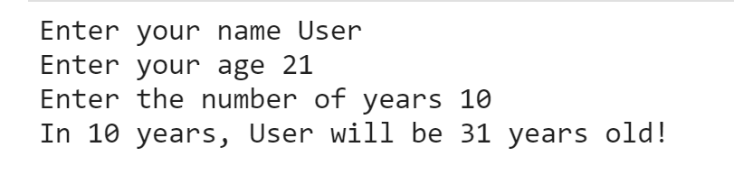
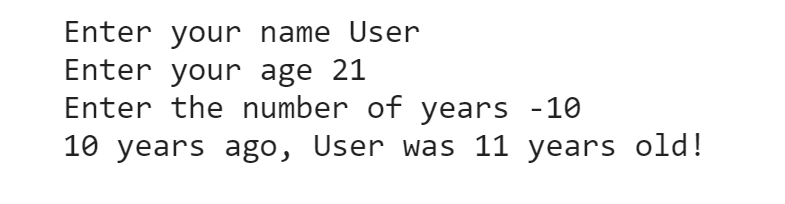

Jake Hill
Aaron Sutton

# Something
___

something.ipynb is an age predicting program which tells any user either what thier age will be after some number of years or what thier age was some number of years ago.
It uses a simple algorithm of adding the number of years to the current age of the user. 

## Usage
---
The input for age should be positive numbers of type int. 
The input for years should also be of type int, but it can be positive or negative.
Entering a positive number of years will return the user's age after (input) years, and entering a negative number will return the user's age -(input) years ago.
> For Positive Input:

> For Negative Input:

## Install
---

